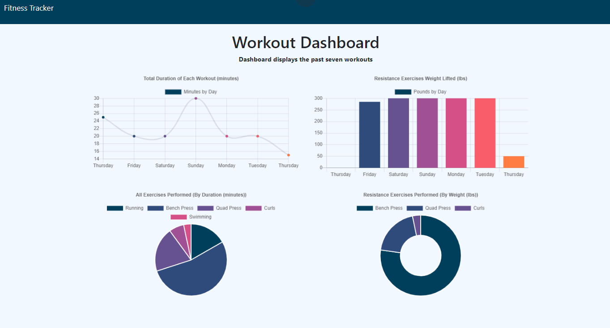

# hw17 Workout-Tracker, 18 MAR 21

#### By Ashley Stith

## Description
This application is a workout tracker that allows a user to view, create and track daily workouts.  The user is able to log multiple exercises of type (resistance or cardio) in a workout for a given day.  It also allows the user to track the name, type, weight, sets, reps, duration and distance traveled for each exercise depending on the type.  In addition, the user is able to add exercises to the most recent workout plan.

A "stats" dashboard is included with 4 charts:

* Total Duration of Each Workout (minutes)
    * Displays the total duration of each workout from the past seven workouts

* Resistance Exercises Weight Lifted (lbs)
    * Displays the combined weight of the resistance exercises from the past seven workouts

* All Exercises Performed (By Duration (minutes))
    * Displays all exercises by duration

* Resistance Exercises Performed (By Weight (lbs))
    * Displays the resistance exercises performed for the past seven workouts by weight

## Features
The application utilizes a Mongo database with Mongoose schema.  It handles routes with Express.  The application is deployed with Heroku and MongoDB Atlas.

## Site Images
### Homepage
The homepage displays the information for the last workout.  The user is able to add an exercise to the workout or create a new workout


### Dashboard
The dashboard displays data for the last seven workouts


## Dependencies
The application includes the following dependencies:

[Epress NPM package](https://www.npmjs.com/package/express)

[Mongoose](https://mongoosejs.com/)

[Morgan](https://www.npmjs.com/package/morgan)

The application is seeded and invoked locally by using the following commands:

```bash
npm run seed
npm start
```

## Installation
* Create a `.gitignore` file and include `node_modules/` and `.DS_Store/`
* Install npm dependencies using the following command:
```bash
npm i
```

## Known Bugs
Site has no known bugs

## Technologies Used
* node.js
* MongoDb
* Mongoose
* Express

## Contribution Guidelines
Direct link to repository: https://github.com/stithac/burger

## Deployment
The site is deployed to heroku: https://arcane-everglades-17005.herokuapp.com/